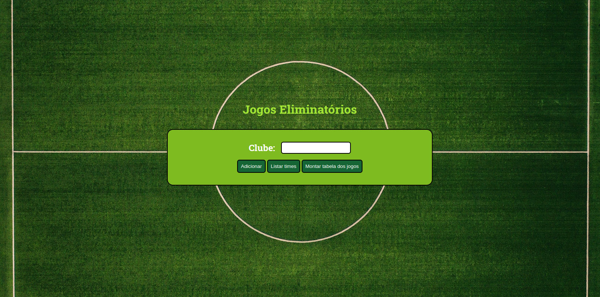
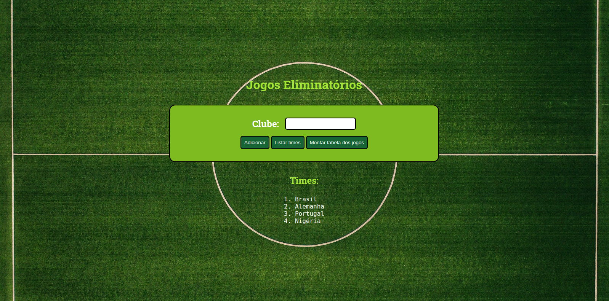
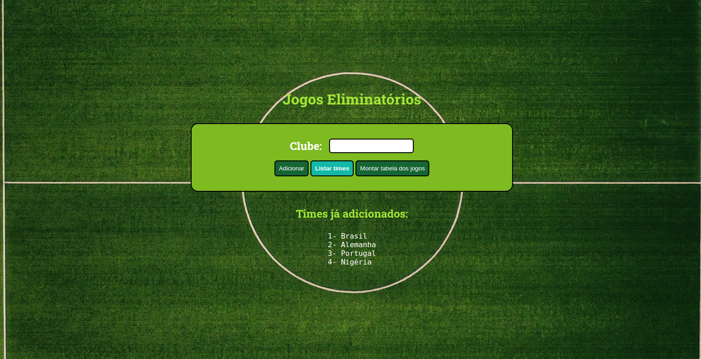
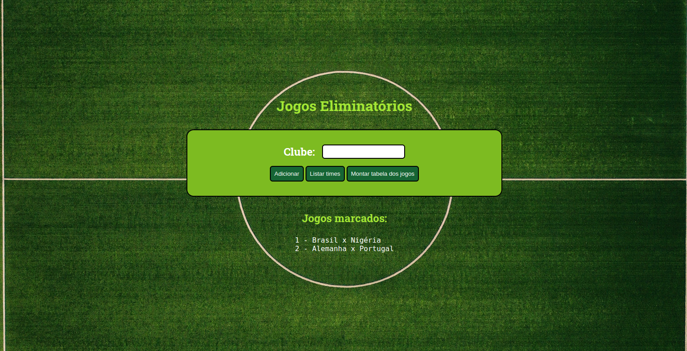

<h1 align="center"> Jogos Eliminatórios </h1>

 

<h3 align="center">Tela inicial</h3>

 
  

## 🚀 Tecnologias

Esse projeto foi desenvolvido com as seguintes tecnologias:

- HTML e CSS
- JavaScript

 
<h3 align="center">Adicionando os times </h3>

 
  

 

 
<h3 align="center">Times listados </h3>

 
  

 

 
<h3 align="center">Tabela de jogos</h3>

 
  

 

## 💻 Projeto

A ideia do programa **Jogos eliminatórios**, foi retirado do livro **Lógica de Programação e Algoritmos com JavaScript** da editora **Novatec**. O programa foi alterado de forma totalmente pessoal para o treino das tecnologias utilizadas.